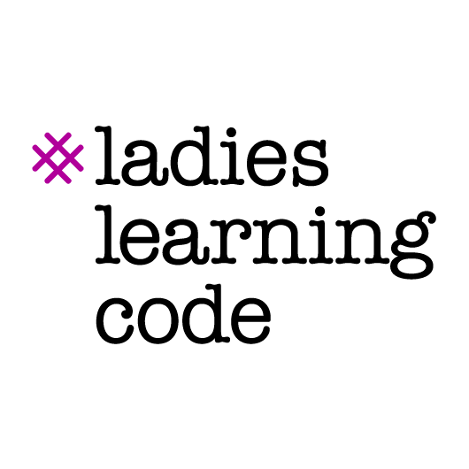
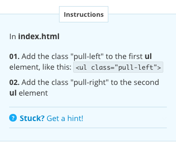
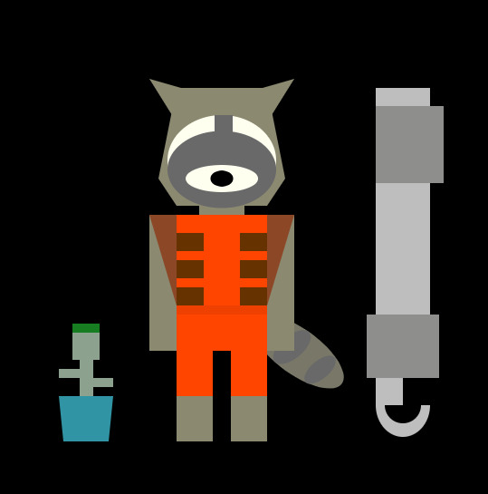
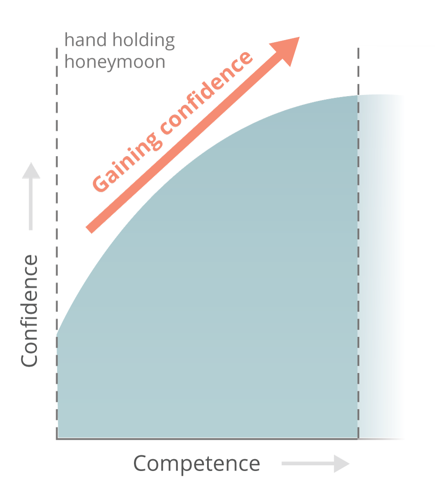
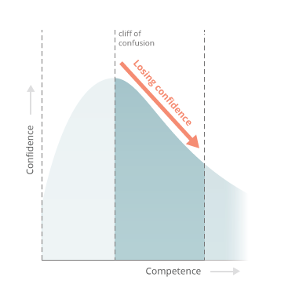
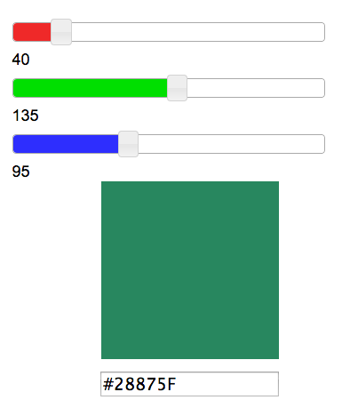
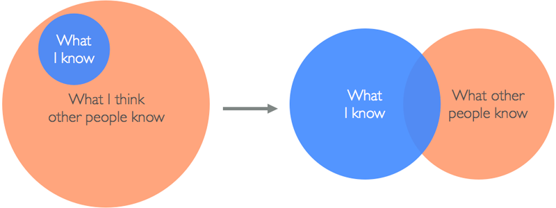

      class: center, middle, dark
      theme: dark
      # Down the Rabbit Hole of Code
      My journey into web development

      Stacey Lin
      [@inklin](http://twitter.com/inklin)
      ---

      # Agenda
      1. About Me
      2. How I fell down the Rabbit Hole of Code
      3. Roadblocks I encountered along the way
      4. Answer to the roadblocks

      ---
      class: center
      # About Me

      .block-img-small[
      
      ]
      Stacey Lin

      [@inklin](http://twitter.com/inklin)

      [staceylin.com](http://staceylin.com)

      Freelance Front End Developer

      Started coding about 7 months ago... how did I get here? 

      ---
      # My first experience with code
      
      .block-img[
      
      ]

      Copy and paste HTML
      ```html
      <center>, <bold>, <strike>, <marquee> 
      ```


      Guest Book, Colored Scroll Bar, many GIFS... 


      ---

      # My one CS course
      Introduction to Computer Science for Multidisciplinary Subjects

      required course for my degree

      first assignment: create a Graphical Python program

      ... no more Computer Science! 


      ---

      # Ladies Learning Code

      CSS for Beginners worshop

      Intro to JavaScript workshop
      .block-img[
      
      ]

      ---

      # Codecademy

      Make a Website

      Easy and approachable... maybe a little *too* approachable? 

      .block-img[
      
      ]

      ---

      # 180 days of Code

      Inspired by Jennifer Dewalt's [180 Days of Code](http://jenniferdewalt.com)

      Face your fear... and draw a face

      .block-img[
      
      ]

      ---

      # Joining a startup: Trippeo

      working with Microsoft Visual Studio

      Dashboard and Landing Page
      .block-img-wide[
      
      ]

      ---
      # Roadblocks along the way

      1. Handholding and the cliff of confusion

      2. Where to get help

      3. What I should learn

      4. Changing expectations

      5. Imposter Syndrome

      ---
      # 1. Handholding & the Cliff of Confusion

      An empty text editor... what do I write again? 
      .inline-img-half[
      
      ]
      .inline-img-half[
      
      ]

      .footnote[
      Credit: Erik Trautman on Viking Code School Blog
      ]

      ---
      # 2. Where can I get help ?

      Google

      Stackoverflow

      Programming books

      Meetups

      Workshops

      Ask a Friend (but keep your keyboard **sacred**!)

      ---
      # 3. What should I be learning ?

      CSS3 animations?

      Algorithms and logic?

      JavaScript frameworks? 

      Back end languages?

      *"It's better to have one sharp blade in the kitchen than many dull ones."*
      .block-img[
      
      ]

      ---
      # 4. Changing expectations

      The wins feel **smaller**. 

      "I should be better than this."

      .inline-img-half[
      
      ]
      .inline-img-half[
      
      ]
      ---
      # 5. Imposter Syndrome

      "I live to code another day."

      "What if I can't figure it out?"

      "People will find out I'm not a **real** developer."
      .block-img-wide[
      
      ]

      ---
      # Answer? 

      Break the task into **small achievable goals ** (S.A.G) and just **go for it**.
      .block-img[
      ]

      ---
      class: center, middle
      # Thank You

      Let's connect! [@inklin](http://twitter.com/inklin)