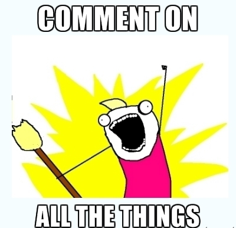
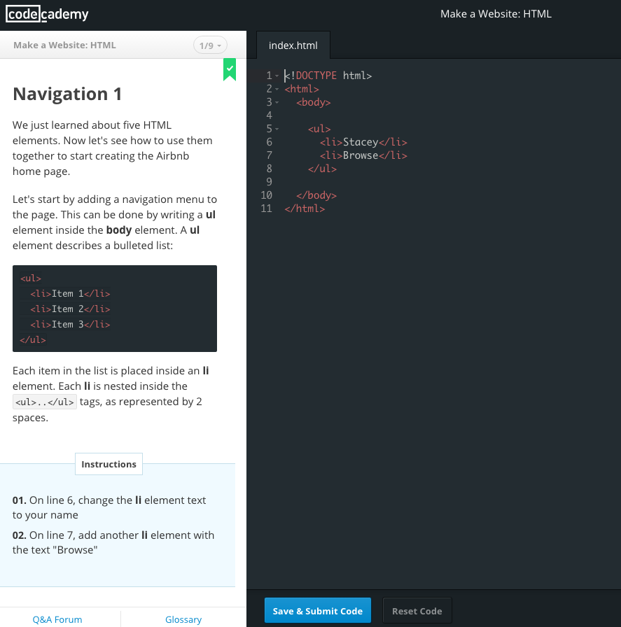
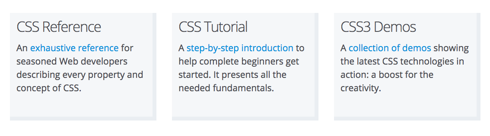
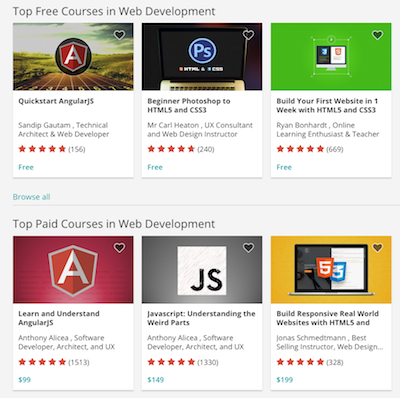
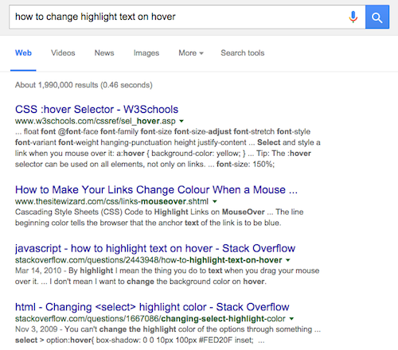
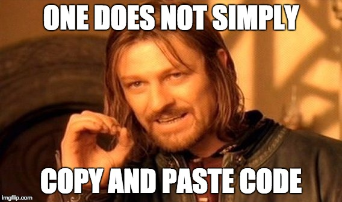

    class: center, middle

    # Hackapalooza! Now what? 

    tips and resources for beginners learning to code

    Stacey Lin

    ---

    # About Me - Stacey Lin

    .profile-img[]
    
    first LLC workshop in Oct 2014
    
    Junior Front End Developer

    Soon... Lighthouse Labs Web Development Bootcamp student!

    ---

    # I just finished a workshop...

    1. Review while it's fresh!

    2. Write comments explaining the code

    3. Add or change things

    .comment[]

    ---

    # Continue with Online Learning

    Interactive Code websites

    - Codecademy, Khan Academy (both free)

    .screenshot[]

    ---

    # Continue with Online Learning

    Mozilla Developer Network

    http://developer.mozilla.org

    .mozilla[]

    ---

    # Continue with Online Learning

    Courses

    1. Udemy, Udacity
    2. Coursera, edX

    .udemy[]

    ---

    # Keep Building Things - SAG

    Small Achievable Goals

    - Small measureable goals build confidence

    .chicken[]

    ---

    # Keep Building - Google

    .google[]
    ---

    # Keep Building - Don't Copy & Paste

    - Type everything 
    - Don't take code snippets if you don't understand them

    

    ---

    # Keep Building - Get Stuck

    "Let's work the problem, people. Let's not make things any worse by guessing." - Apollo 13 film

    - Feeling frustrated is normal
    - There is almost certainly a solution out there

    .duck[]

    ---

    # Continue Learning In Person

    

    - Oct 13 & 14 HTML & CSS for Beginners

    - Oct 24 - JavaScript for Beginners

    - Oct 26 & 27 - Responsive Design for Beginners

    ---

    # Continue Learning in Person

    Bootcamps:
    Part time and full time programs. 

    .bootcamp[]
    .bootcamp[]
    .bootcamp[]

    ---

    # Continue Learning in Person

    Schools (Part Time and Full Time studies)

    .school[]
    .school[]
    .school[]

    ---
    class: middle, center

    # Good luck

    Stacey Lin

    twitter: @inklin

    e-mail: twstacey@gmail.com

    http://staceylin.com

